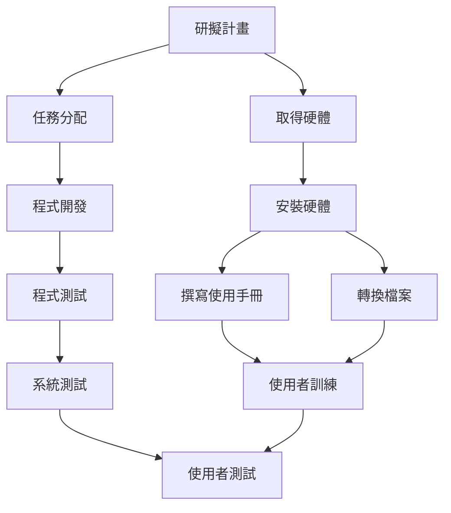
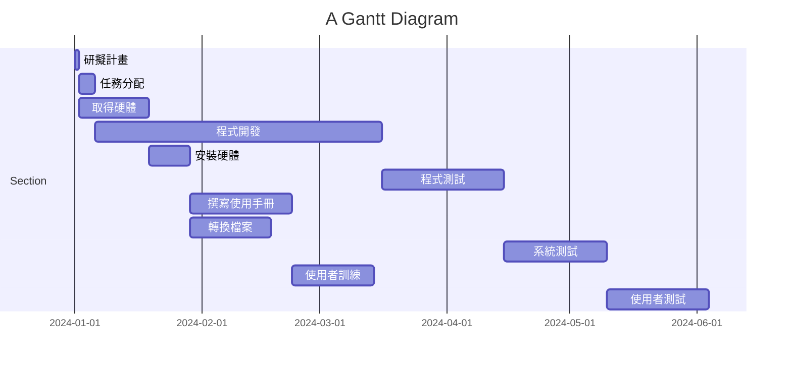

### 任務及任務模式

```mermaid
graph TD
    A["研擬計畫"] --> B["任務分配"] & C["取得硬體"]
    B --> D["程式開發"]
    C --> E["安裝硬體"]
    D --> F["程式測試"]
    E --> G["撰寫使用手冊"] & H["轉換檔案"]
    F --> I["系統測試"]
    G --> J["使用者訓練"]
    H --> J
    I --> K["使用者測試"]
    J --> K
```
### 開始及結束時間
#### 開始：第1天
#### 結束：第155天
### PERT/CPM圖

### 甘特圖

```mermaid
gantt
    title A Gantt Diagram
    section Section
    研擬計畫     :a1, 2024-1-01, 01d
    任務分配     :a2, after a1, 04d
    取得硬體     :a3, after a1, 17d
    程式開發     :a4, after a2, 70d
    安裝硬體     :a5, after a3, 10d
    程式測試     :a6, after a4, 30d
    撰寫使用手冊     :a7, after a5, 25d
    轉換檔案     :a8, after a5, 20d
    系統測試     :a9, after a6, 25d
    使用者訓練     :a10, after a7 a8, 20d
    使用者測試     :a11, after a9 a10, 25d
```
### 關鍵路徑

#### 關鍵路徑 : 1->2->4->6->9->11
