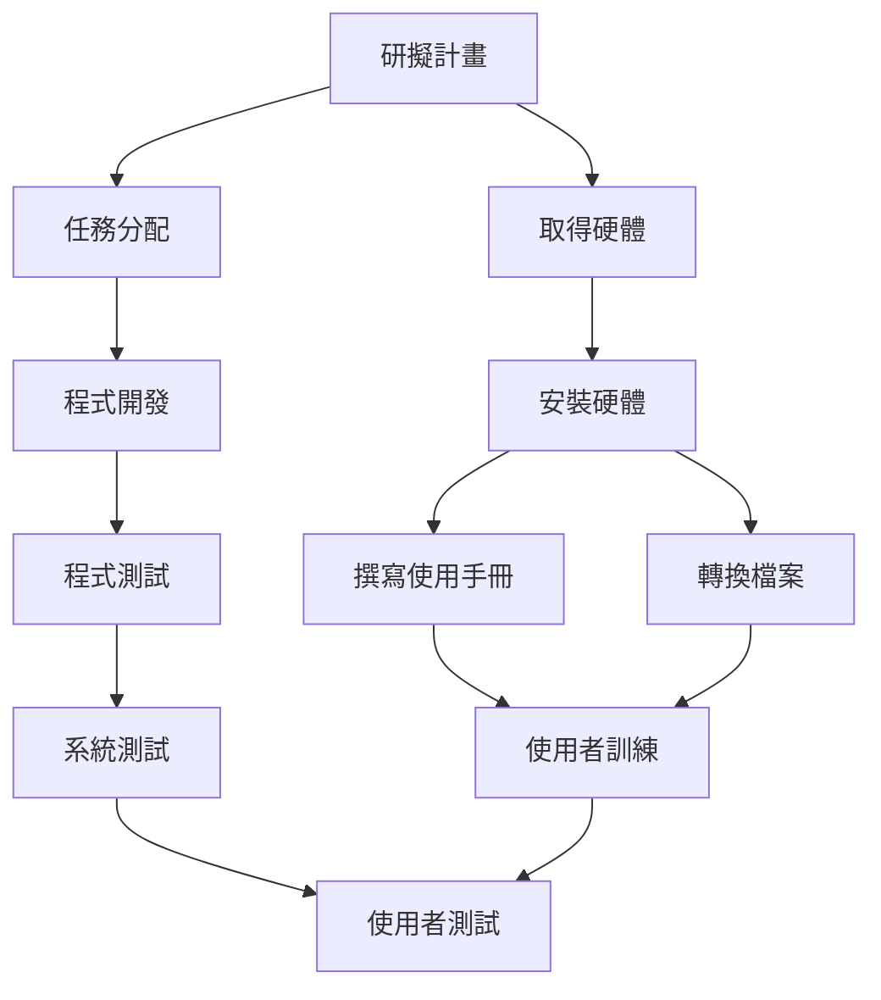

### 任務及任務模式

```mermaid
graph TD
    A["研擬計畫"] --> B["任務分配"] & C["取得硬體"]
    B --> D["程式開發"]
    C --> E["安裝硬體"]
    D --> F["程式測試"]
    E --> G["撰寫使用手冊"] & H["轉換檔案"]
    F --> I["系統測試"]
    G --> J["使用者訓練"]
    H --> J
    I --> K["使用者測試"]
    J --> K
```
### 開始及結束時間
#### 開始：第1天
#### 結束：第155天
### PERT/CPM圖

### 甘特圖

### 關鍵路徑

